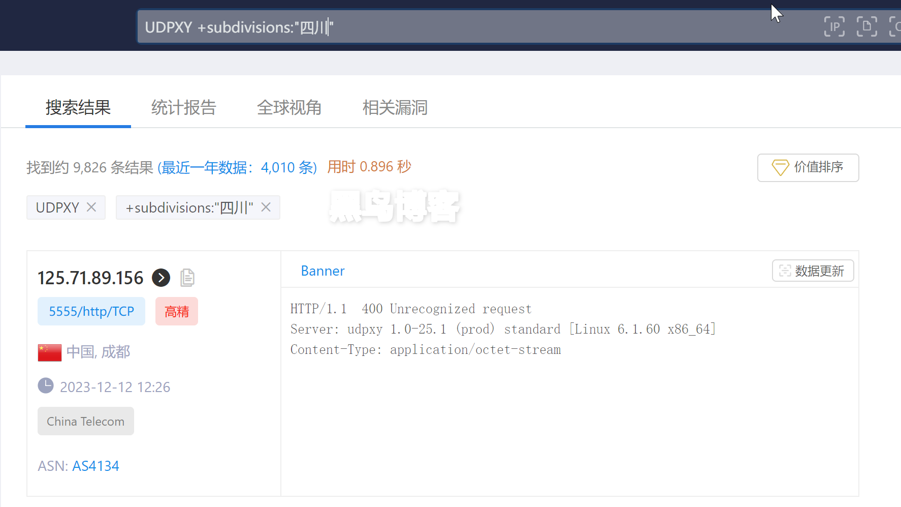

# gs-10000

## m3u

`https://mirror.ghproxy.com/https://raw.githubusercontent.com/RalfZhang/gs-10000/main/gather.m3u`

## 学习资料

### IPTV 组播源转发

#### 1. 公网方案

原始文档 https://guihet.com/zhihu-p639764352.html
*已存 web archive

https://www.zoomeye.org/searchResult?q=UDPXY%20%2Bsubdivisions%3A%22%E7%94%98%E8%82%83%22
https://fofa.info/result?qbase64=VURQWFkgICAmJiByZWdpb249IkdhbnN1Ig%3D%3D

#### 2. 内网方案

- 路由器（AX6000）刷 openWrt
- 可以顺便装上 v2ray https://github.com/kuoruan/openwrt-v2ray
- 本地局域网IPTV口接直播 + 组播转单薄局域网任意播
    - https://github.com/lelehub/udpxy-IPTV
    - https://github.com/qwerttvv/Beijing-IPTV/blob/master/howto.md
    - https://blog.lishun.me/iptvhelper-guide
- 其他工具：爱快 ikuai